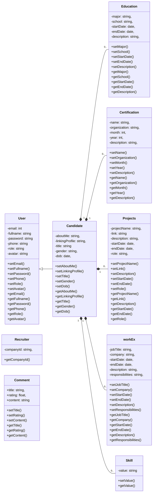

```mermaid
classDiagram
direction LR
   class User{
     -email: int
     -fullname: string
     -password: string
     -phone: string
     -role: string
     -avatar: string
     +setEmail()
     +setFullname()
     +setPassword()
     +setPhone()
     +setRole()
     +setAvatar()
     +getEmail()
     +getFullname()
     +getPassword()
     +getPhone()
     +getRole()
     +getAvatar()
   }
   class Candidate {
    -aboutMe: string,
    -linkingProfile: string,
    -title: string
    -gender: string,
    -dob: date,
    +setAboutMe()
    +setLinkingProfile()
    +setTitle()
    +setGender()
    +setDob()
    +getAboutMe()
    +getLinkingProfile()
    +getTitle()
    +getGender()
    +getDob()
   }
   class Recruiter {
    -companyId: string,
    +getCompanyId()
   }
    class Certification {
    -name: string,
    -organization: string,
    -month: int,
    -year: int,
    -description: string,
    +setName()
    +setOrganization()
    +setMonth()
    +setYear()
    +setDescription()
    +getName()
    +getOrganization()
    +getMonth()
    +getYear()
    +getDescription()
    }
   class Projects {
    -projectName: string,
    -link: string
    -description: string,
    -startDate: date,
    -endDate: date,
    -role: string,
    +setProjectName()
    +setLink()
    +setDescription()
    +setStartDate()
    +setEndDate()
    +setRole()
    +getProjectName()
    +getLink()
    +getDescription()
    +getStartDate()
    +getEndDate()
    +getRole()
   }
   class workEx{
    -jobTitle: string,
    -company: string,
    -startDate: date,
    -endDate: date,
    -description: string,
    -responsibilities: string,
    +setJobTitle()
    +setCompany()
    +setStartDate()
    +setEndDate()
    +setDescription()
    +setResponsibilities()
    +getJobTitle()
    +getCompany()
    +getStartDate()
    +getEndDate()
    +getDescription()
    +getResponsibilities()
   }
   class Skill{
    -value: string
    +setValue()
    +getValue()
   }
   class Education {
    -major: string,
    -school: string,
    -startDate: date,
    -endDate: date,
    -description: string,
    +setMajor()
    +setSchool()
    +setStartDate()
    +setEndDate()
    +setDescription()
    +getMajor()
    +getSchool()
    +getStartDate()
    +getEndDate()
    +getDescription()
   }
    Candidate "1"*--"0.." Education
    Candidate "1"*--"0.." Certification
    Candidate "1"*--"0.." Projects
    Candidate "1"*--"0.." workEx
    Candidate "1"*--"0.." Skill
    User <|-- Candidate


    class Comment{
        +title: string,
        +rating: float,
        +content: string
        +setTitle()
        +setRating()
        +setContent()
        +getTitle()
        +getRating()
        +getContent()
    }
```
