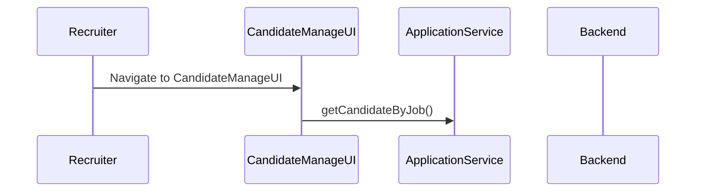

```mermaid
sequenceDiagram
    participant R as Recruiter
    participant W as CandidateManageUI
    participant S as ApplicationService
    participant B as Backend

    R->>W: Navigate to CandidateManageUI
    W->>S: getCandidateByJob()
```
