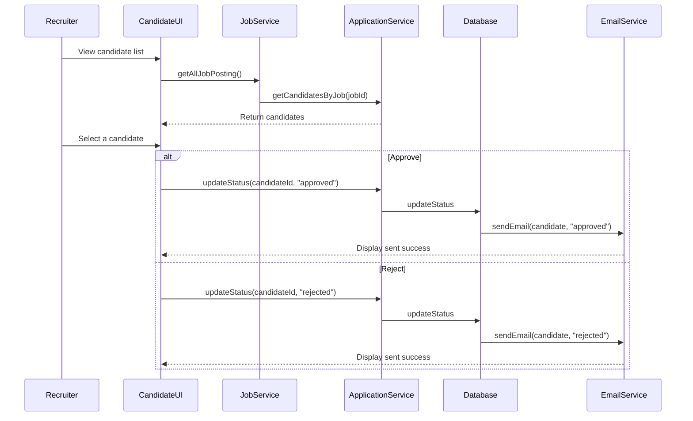

```mermaid
sequenceDiagram
    participant R as Recruiter
    participant UI as CandidateUI
    participant S as JobService
    participant C as ApplicationService
    participant B as Database
    participant E as EmailService

    R->>UI: View candidate list
    UI->>S: getAllJobPosting()
    S->>C: getCandidatesByJob(jobId)
    C-->>UI: Return candidates

    R->>UI: Select a candidate
    alt Approve
        UI->>C: updateStatus(candidateId, "approved")
        C->>B: updateStatus
        B->>E: sendEmail(candidate, "approved")
        E-->>UI: Display sent success
    else Reject
        UI->>C: updateStatus(candidateId, "rejected")
        C->>B: updateStatus
        B->>E: sendEmail(candidate, "rejected")
        E-->>UI: Display sent success
    end
```
