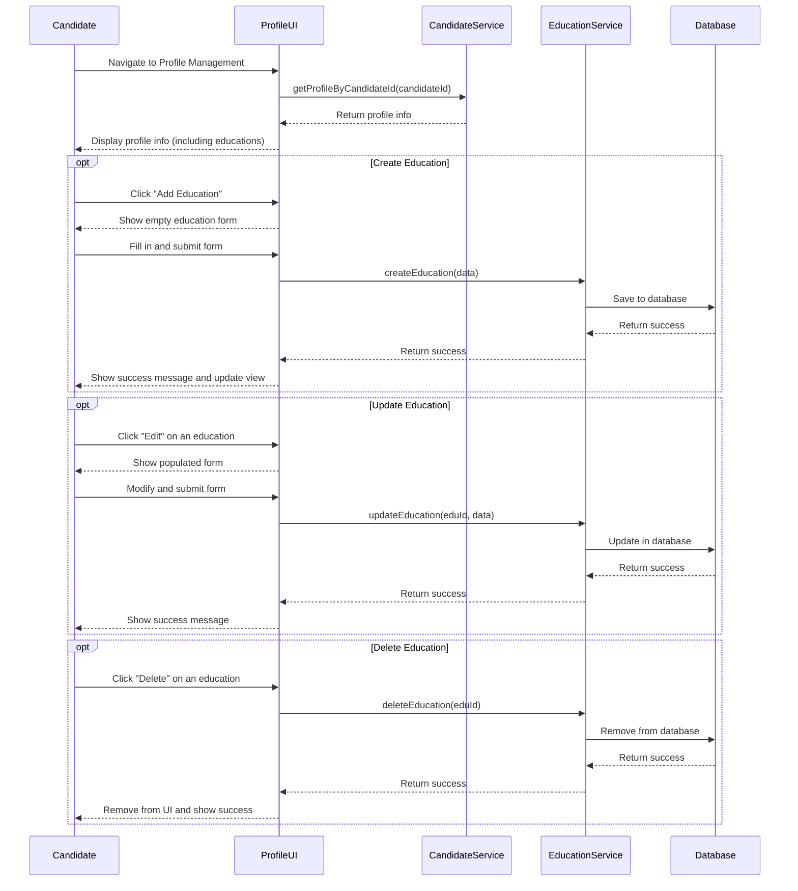

```mermaid
sequenceDiagram
    participant C as Candidate
    participant W as ProfileUI
    participant S as CandidateService
    participant E as EducationService
    participant B as Database

    C->>W: Navigate to Profile Management
    W->>S: getProfileByCandidateId(candidateId)
    S-->>W: Return profile info
    W-->>C: Display profile info (including educations)

    opt Create Education
        C->>W: Click "Add Education"
        W-->>C: Show empty education form
        C->>W: Fill in and submit form
        W->>E: createEducation(data)
        E->>B: Save to database
        B-->>E: Return success
        E-->>W: Return success
        W-->>C: Show success message and update view
    end

    opt Update Education
        C->>W: Click "Edit" on an education
        W-->>C: Show populated form
        C->>W: Modify and submit form
        W->>E: updateEducation(eduId, data)
        E->>B: Update in database
        B-->>E: Return success
        E-->>W: Return success
        W-->>C: Show success message
    end

    opt Delete Education
        C->>W: Click "Delete" on an education
        W->>E: deleteEducation(eduId)
        E->>B: Remove from database
        B-->>E: Return success
        E-->>W: Return success
        W-->>C: Remove from UI and show success
    end

```
