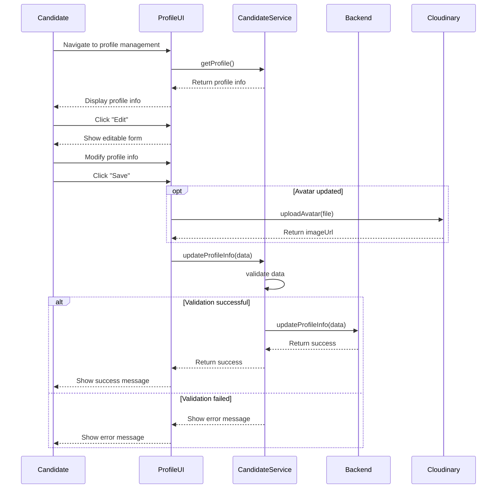

```mermaid
sequenceDiagram
    participant C as Candidate
    participant U as ProfileUI
    participant S as CandidateService
    participant B as Backend
    participant CDN as Cloudinary

    C->>U: Navigate to profile management
    U->>S: getProfile()
    S-->>U: Return profile info
    U-->>C: Display profile info

    C->>U: Click "Edit"
    U-->>C: Show editable form

    C->>U: Modify profile info
    C->>U: Click "Save"

    opt Avatar updated
        U->>CDN: uploadAvatar(file)
        CDN-->>U: Return imageUrl
    end

    U->>S: updateProfileInfo(data)
    S->>S: validate data
    alt Validation successful
        S->>B: updateProfileInfo(data)
        B-->>S: Return success
        S-->>U: Return success
        U-->>C: Show success message

    else Validation failed
        S-->>U: Show error message
        U-->>C: Show error message
    end

```
