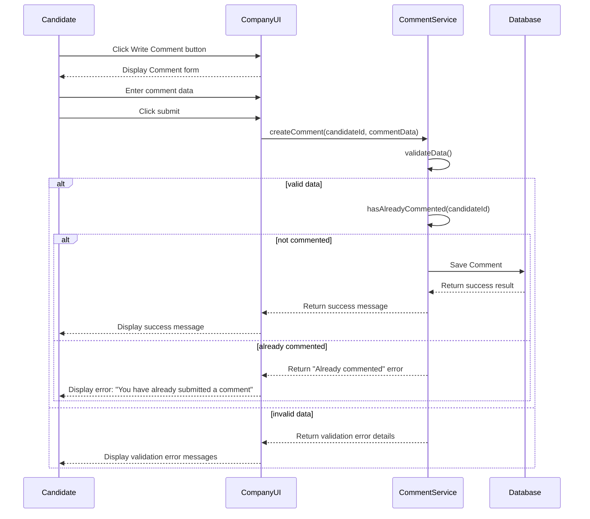

```mermaid
sequenceDiagram
    participant C as Candidate
    participant W as CompanyUI
    participant S as CommentService
    participant B as Database

    C->>W: Click Write Comment button
    W-->>C: Display Comment form
    C->>W: Enter comment data
    C->>W: Click submit
    W->>S: createComment(candidateId, commentData)
    S->>S: validateData()
    alt valid data
        S->>S: hasAlreadyCommented(candidateId)
        alt not commented
            S->>B: Save Comment
            B-->>S: Return success result
            S-->>W: Return success message
            W-->>C: Display success message
        else already commented
            S-->>W: Return "Already commented" error
            W-->>C: Display error: "You have already submitted a comment"
        end
    else invalid data
        S-->>W: Return validation error details
        W-->>C: Display validation error messages
    end
```
