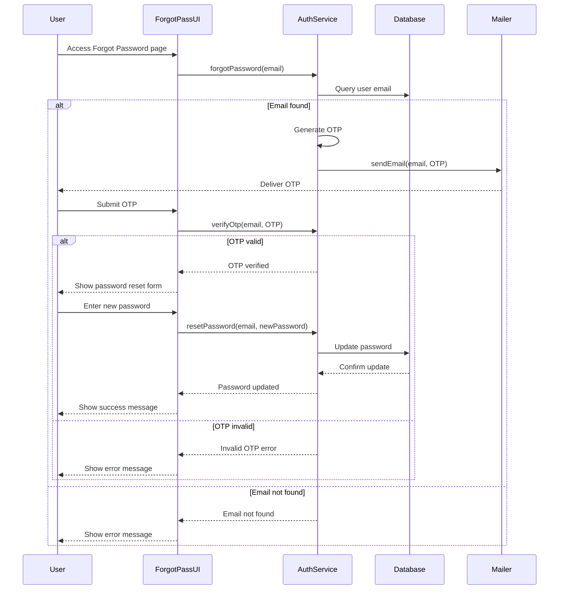

```mermaid
sequenceDiagram
    participant C as User
    participant F as ForgotPassUI
    participant A as AuthService
    participant B as Database
    participant M as Mailer

    C->>F: Access Forgot Password page
    F->>A: forgotPassword(email)
    A->>B: Query user email

    alt Email found
        A->>A: Generate OTP
        A->>M: sendEmail(email, OTP)
        M-->>C: Deliver OTP
        C->>F: Submit OTP
        F->>A: verifyOtp(email, OTP)

        alt OTP valid
            A-->>F: OTP verified
            F-->>C: Show password reset form
            C->>F: Enter new password
            F->>A: resetPassword(email, newPassword)
            A->>B: Update password
            B-->>A: Confirm update
            A-->>F: Password updated
            F-->>C: Show success message
        else OTP invalid
            A-->>F: Invalid OTP error
            F-->>C: Show error message
        end
    else Email not found
        A-->>F: Email not found
        F-->>C: Show error message
    end

```
