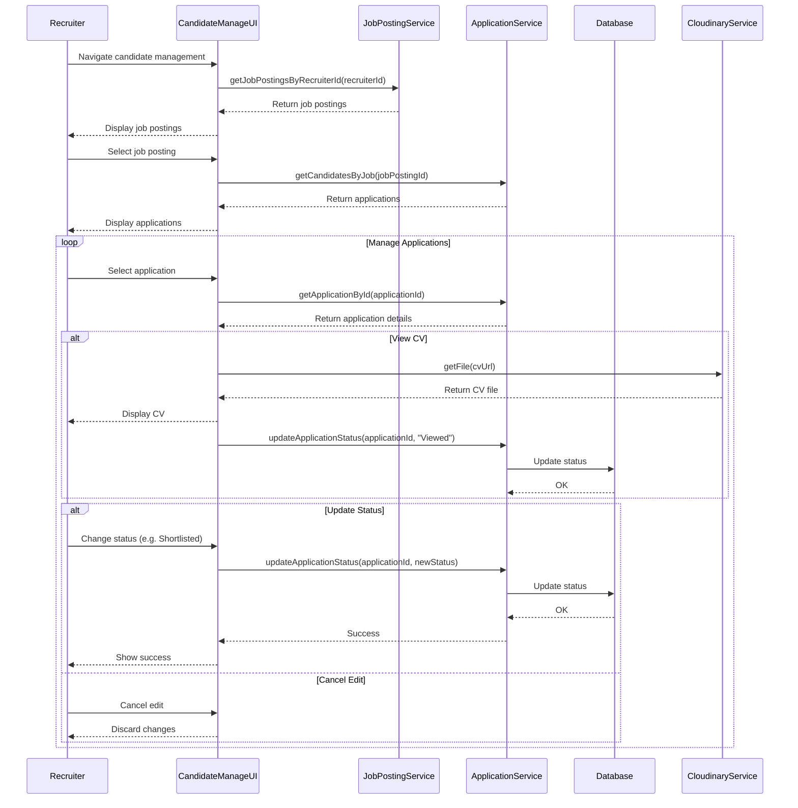

```mermaid
sequenceDiagram
    participant R as Recruiter
    participant UI as CandidateManageUI
    participant JP as JobPostingService
    participant AS as ApplicationService
    participant DB as Database
    participant C as CloudinaryService

    R->>UI: Navigate candidate management
    UI->>JP: getJobPostingsByRecruiterId(recruiterId)
    JP-->>UI: Return job postings
    UI-->>R: Display job postings

    R->>UI: Select job posting
    UI->>AS: getCandidatesByJob(jobPostingId)
    AS-->>UI: Return applications
    UI-->>R: Display applications

    loop Manage Applications
        R->>UI: Select application
        UI->>AS: getApplicationById(applicationId)
        AS-->>UI: Return application details

        alt View CV
            UI->>C: getFile(cvUrl)
            C-->>UI: Return CV file
            UI-->>R: Display CV
            UI->>AS: updateApplicationStatus(applicationId, "Viewed")
            AS->>DB: Update status
            DB-->>AS: OK
        end

        alt Update Status
            R->>UI: Change status (e.g. Shortlisted)
            UI->>AS: updateApplicationStatus(applicationId, newStatus)
            AS->>DB: Update status
            DB-->>AS: OK
            AS-->>UI: Success
            UI-->>R: Show success
        else Cancel Edit
            R->>UI: Cancel edit
            UI-->>R: Discard changes
        end
    end

```
