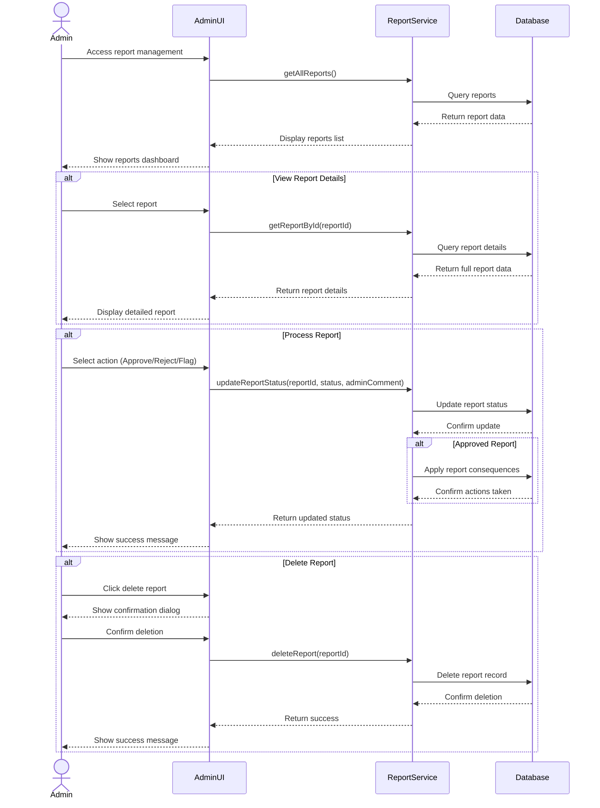

```mermaid
sequenceDiagram
    actor A as Admin
    participant UI as AdminUI
    participant RS as ReportService
    participant DB as Database

    A->>UI: Access report management
    UI->>RS: getAllReports()
    RS->>DB: Query reports
    DB-->>RS: Return report data
    RS-->>UI: Display reports list
    UI-->>A: Show reports dashboard

    alt View Report Details
        A->>UI: Select report
        UI->>RS: getReportById(reportId)
        RS->>DB: Query report details
        DB-->>RS: Return full report data
        RS-->>UI: Return report details
        UI-->>A: Display detailed report
    end

    alt Process Report
        A->>UI: Select action (Approve/Reject/Flag)
        UI->>RS: updateReportStatus(reportId, status, adminComment)
        RS->>DB: Update report status
        DB-->>RS: Confirm update

        alt Approved Report
            RS->>DB: Apply report consequences
            DB-->>RS: Confirm actions taken
        end

        RS-->>UI: Return updated status
        UI-->>A: Show success message
    end

    alt Delete Report
        A->>UI: Click delete report
        UI-->>A: Show confirmation dialog
        A->>UI: Confirm deletion
        UI->>RS: deleteReport(reportId)
        RS->>DB: Delete report record
        DB-->>RS: Confirm deletion
        RS-->>UI: Return success
        UI-->>A: Show success message
    end
```
