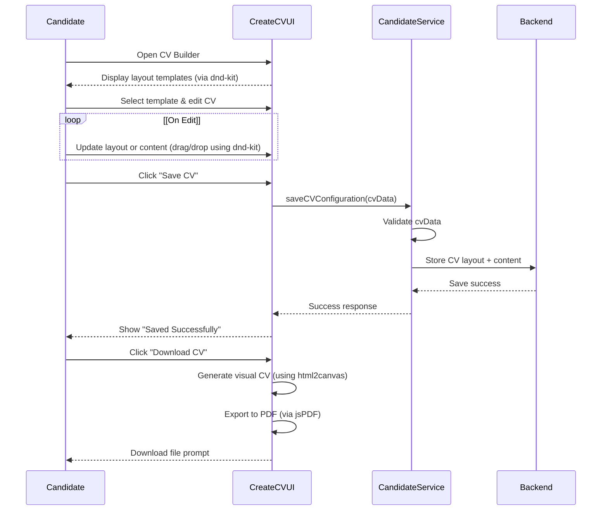

```mermaid
sequenceDiagram
    participant Candidate
    participant CreateCVUI
    participant CandidateService
    participant Backend

    Candidate->>CreateCVUI: Open CV Builder
    CreateCVUI-->>Candidate: Display layout templates (via dnd-kit)
    Candidate->>CreateCVUI: Select template & edit CV
    loop [On Edit]
        Candidate->>CreateCVUI: Update layout or content (drag/drop using dnd-kit)
    end
    Candidate->>CreateCVUI: Click "Save CV"
    CreateCVUI->>CandidateService: saveCVConfiguration(cvData)
    CandidateService->>CandidateService: Validate cvData
    CandidateService->>Backend: Store CV layout + content
    Backend-->>CandidateService: Save success
    CandidateService-->>CreateCVUI: Success response
    CreateCVUI-->>Candidate: Show "Saved Successfully"

    %% Optional Download (Export) Flow
    Candidate->>CreateCVUI: Click "Download CV"
    CreateCVUI->>CreateCVUI: Generate visual CV (using html2canvas)
    CreateCVUI->>CreateCVUI: Export to PDF (via jsPDF)
    CreateCVUI-->>Candidate: Download file prompt

```
