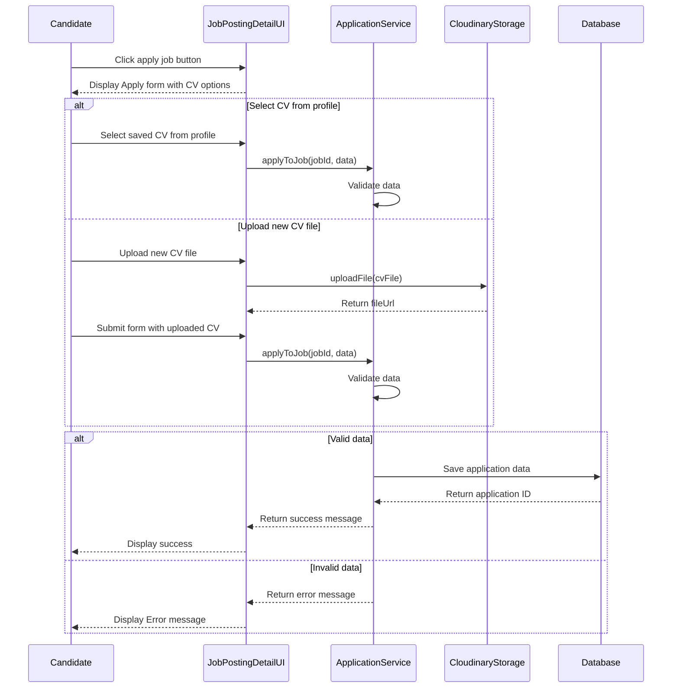

```mermaid
sequenceDiagram
    participant Candidate
    participant JobPostingDetailUI
    participant ApplicationService
    participant CloudinaryStorage
    participant Database

    Candidate->>JobPostingDetailUI: Click apply job button
    JobPostingDetailUI-->>Candidate: Display Apply form with CV options

    alt Select CV from profile
        Candidate->>JobPostingDetailUI: Select saved CV from profile
        JobPostingDetailUI->>ApplicationService: applyToJob(jobId, data)
        ApplicationService->>ApplicationService: Validate data
    else Upload new CV file
        Candidate->>JobPostingDetailUI: Upload new CV file
        JobPostingDetailUI->>CloudinaryStorage: uploadFile(cvFile)
        CloudinaryStorage-->>JobPostingDetailUI: Return fileUrl
        Candidate->>JobPostingDetailUI: Submit form with uploaded CV
        JobPostingDetailUI->>ApplicationService: applyToJob(jobId, data)
        ApplicationService->>ApplicationService: Validate data
    end

    alt Valid data
        ApplicationService->>Database: Save application data
        Database-->>ApplicationService: Return application ID
        ApplicationService-->>JobPostingDetailUI: Return success message
        JobPostingDetailUI-->>Candidate: Display success
    else Invalid data
        ApplicationService-->>JobPostingDetailUI: Return error message
        JobPostingDetailUI-->>Candidate: Display Error message
    end

```
