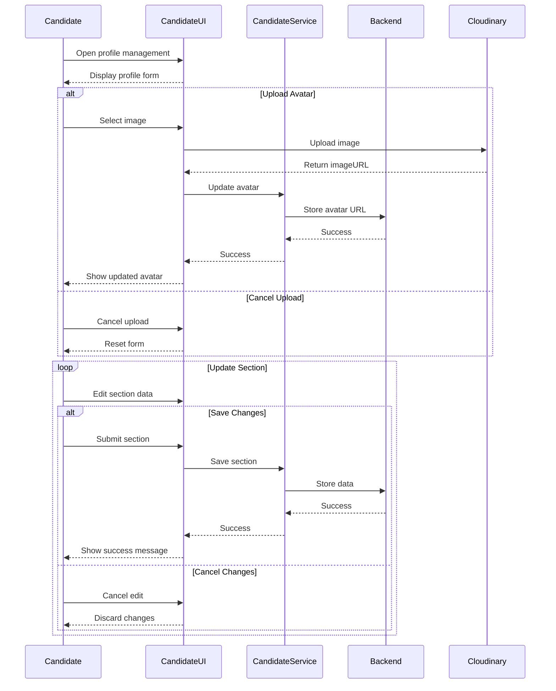

```mermaid
sequenceDiagram
    participant C as Candidate
    participant UI as CandidateUI
    participant S as CandidateService
    participant B as Backend
    participant CDN as Cloudinary

    C->>UI: Open profile management
    UI-->>C: Display profile form

    alt Upload Avatar
        C->>UI: Select image
        UI->>CDN: Upload image
        CDN-->>UI: Return imageURL
        UI->>S: Update avatar
        S->>B: Store avatar URL
        B-->>S: Success
        S-->>UI: Success
        UI-->>C: Show updated avatar
    else Cancel Upload
        C->>UI: Cancel upload
        UI-->>C: Reset form
    end

    loop Update Section
        C->>UI: Edit section data
        alt Save Changes
            C->>UI: Submit section
            UI->>S: Save section
            S->>B: Store data
            B-->>S: Success
            S-->>UI: Success
            UI-->>C: Show success message
        else Cancel Changes
            C->>UI: Cancel edit
            UI-->>C: Discard changes
        end
    end

```
