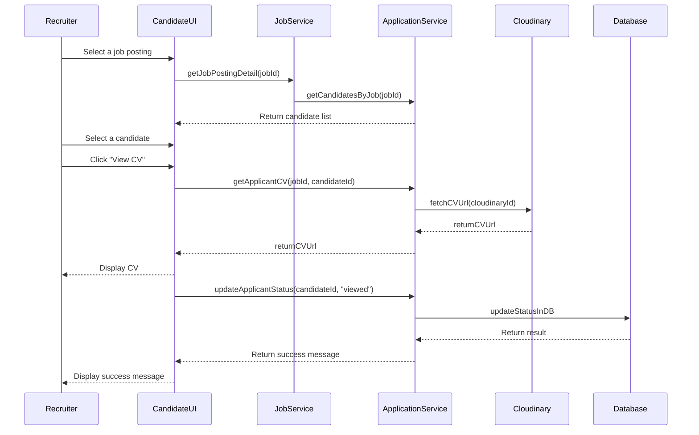

```mermaid
sequenceDiagram
    participant R as Recruiter
    participant UI as CandidateUI
    participant S as JobService
    participant C as ApplicationService
    participant E as Cloudinary
    participant B as Database

    R->>UI: Select a job posting
    UI->>S: getJobPostingDetail(jobId)
    S->>C: getCandidatesByJob(jobId)
    C-->>UI: Return candidate list

    R->>UI: Select a candidate
    R->>UI: Click "View CV"
    UI->>C: getApplicantCV(jobId, candidateId)
    C->>E: fetchCVUrl(cloudinaryId)
    E-->>C: returnCVUrl
    C-->>UI: returnCVUrl
    UI-->>R: Display CV

    UI->>C: updateApplicantStatus(candidateId, "viewed")
    C->>B: updateStatusInDB
    B-->>C: Return result
    C-->>UI: Return success message
    UI-->>R: Display success message

```
