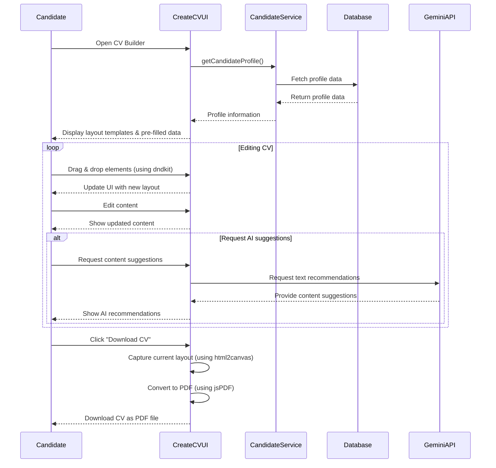

```mermaid
sequenceDiagram
    participant Candidate
    participant CreateCVUI
    participant CandidateService
    participant Database
    participant GeminiAPI

    Candidate->>CreateCVUI: Open CV Builder
    CreateCVUI->>CandidateService: getCandidateProfile()
    CandidateService->>Database: Fetch profile data
    Database-->>CandidateService: Return profile data
    CandidateService-->>CreateCVUI: Profile information
    CreateCVUI-->>Candidate: Display layout templates & pre-filled data

    loop Editing CV
        Candidate->>CreateCVUI: Drag & drop elements (using dndkit)
        CreateCVUI-->>Candidate: Update UI with new layout
        Candidate->>CreateCVUI: Edit content
        CreateCVUI-->>Candidate: Show updated content

        alt Request AI suggestions
            Candidate->>CreateCVUI: Request content suggestions
            CreateCVUI->>GeminiAPI: Request text recommendations
            GeminiAPI-->>CreateCVUI: Provide content suggestions
            CreateCVUI-->>Candidate: Show AI recommendations
        end
    end

    Candidate->>CreateCVUI: Click "Download CV"
    CreateCVUI->>CreateCVUI: Capture current layout (using html2canvas)
    CreateCVUI->>CreateCVUI: Convert to PDF (using jsPDF)
    CreateCVUI-->>Candidate: Download CV as PDF file
```
