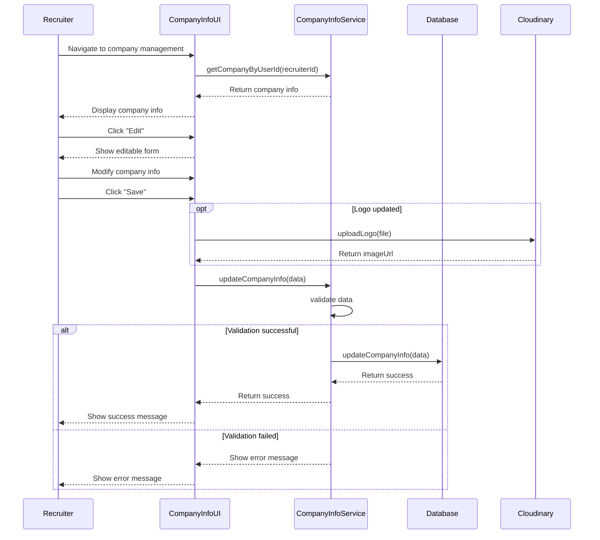

```mermaid
sequenceDiagram
    participant R as Recruiter
    participant U as CompanyInfoUI
    participant S as CompanyInfoService
    participant B as Database
    participant CDN as Cloudinary

    R->>U: Navigate to company management
    U->>S: getCompanyByUserId(recruiterId)
    S-->>U: Return company info
    U-->>R: Display company info

        R->>U: Click "Edit"
        U-->>R: Show editable form

            R->>U: Modify company info
            R->>U: Click "Save"

            opt Logo updated
                U->>CDN: uploadLogo(file)
                CDN-->>U: Return imageUrl
            end

            U->>S: updateCompanyInfo(data)
            S->>S: validate data
            alt Validation successful
                S->>B: updateCompanyInfo(data)
                B-->>S: Return success
                S-->>U: Return success
                U-->>R: Show success message

            else Validation failed
                S-->>U: Show error message
                U-->>R: Show error message
            end


```
