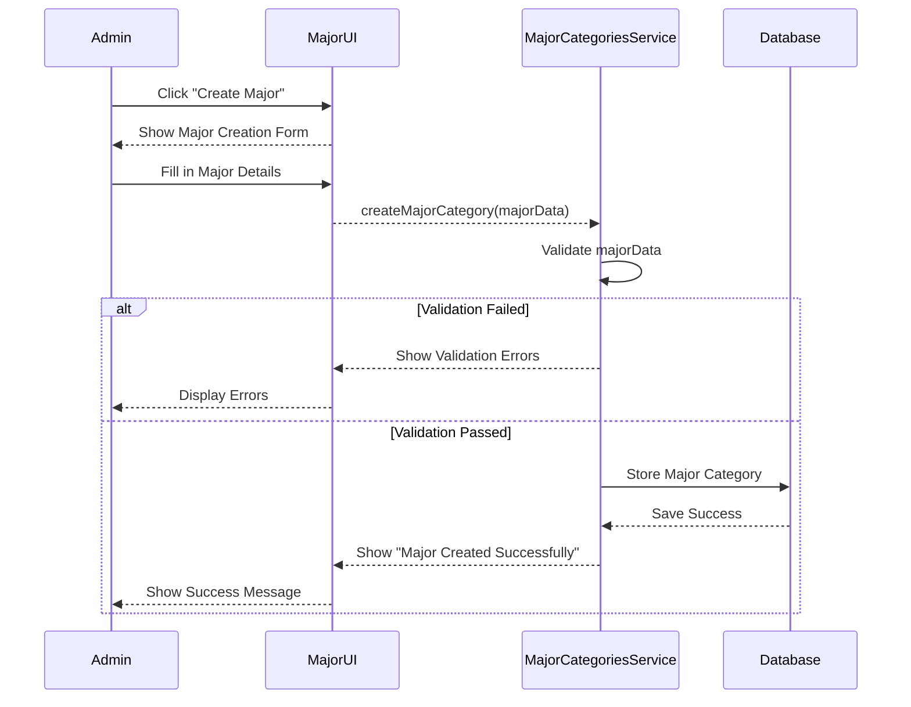

```mermaid
sequenceDiagram
    participant A as Admin
    participant U as MajorUI
    participant C as MajorCategoriesService
    participant B as Database

    A->>U: Click "Create Major"
    U-->>A: Show Major Creation Form
    A->>U: Fill in Major Details
    U-->>C: createMajorCategory(majorData)
    C->>C: Validate majorData
    alt Validation Failed
        C-->>U: Show Validation Errors
        U-->>A: Display Errors
    else Validation Passed
        C->>B: Store Major Category
        B-->>C: Save Success
        C-->>U: Show "Major Created Successfully"
        U-->>A: Show Success Message

    end
```
