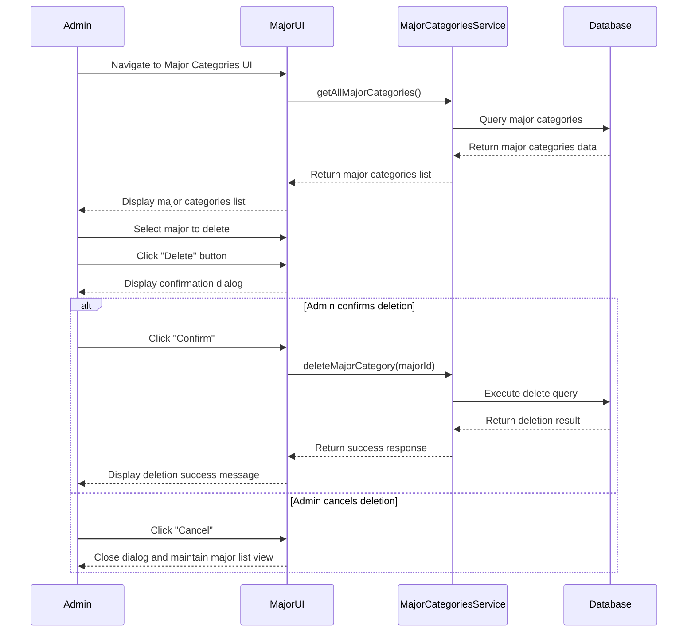

```mermaid
sequenceDiagram
    participant A as Admin
    participant U as MajorUI
    participant C as MajorCategoriesService
    participant B as Database

    A->>U: Navigate to Major Categories UI
    U->>C: getAllMajorCategories()
    C->>B: Query major categories
    B-->>C: Return major categories data
    C-->>U: Return major categories list
    U-->>A: Display major categories list

    A->>U: Select major to delete
    A->>U: Click "Delete" button
    U-->>A: Display confirmation dialog

    alt Admin confirms deletion
        A->>U: Click "Confirm"
        U->>C: deleteMajorCategory(majorId)
        C->>B: Execute delete query
        B-->>C: Return deletion result
        C-->>U: Return success response
        U-->>A: Display deletion success message
    else Admin cancels deletion
        A->>U: Click "Cancel"
        U-->>A: Close dialog and maintain major list view
    end
```
