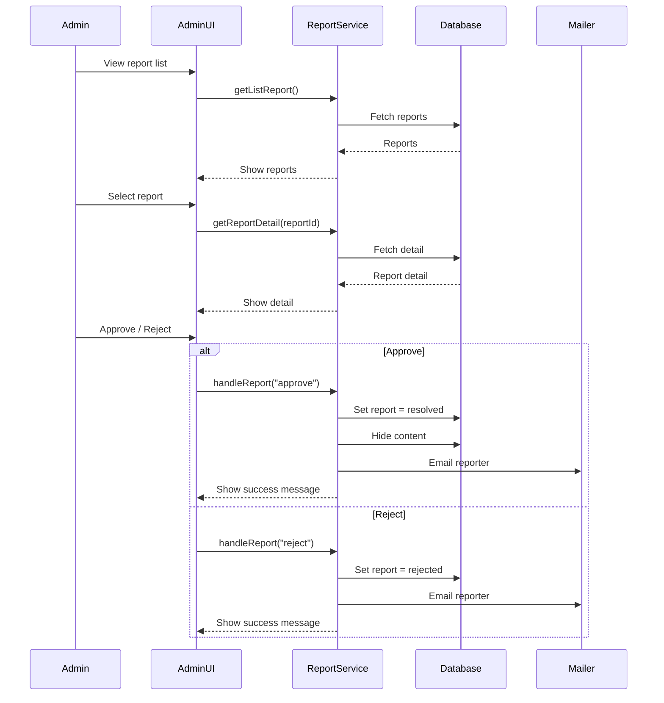

```mermaid
sequenceDiagram
    participant Admin
    participant UI as AdminUI
    participant RS as ReportService
    participant DB as Database
    participant M as Mailer

    Admin->>UI: View report list
    UI->>RS: getListReport()
    RS->>DB: Fetch reports
    DB-->>RS: Reports
    RS-->>UI: Show reports

    Admin->>UI: Select report
    UI->>RS: getReportDetail(reportId)
    RS->>DB: Fetch detail
    DB-->>RS: Report detail
    RS-->>UI: Show detail

    Admin->>UI: Approve / Reject

    alt Approve
        UI->>RS: handleReport("approve")
        RS->>DB: Set report = resolved
        RS->>DB: Hide content
        RS->>M: Email reporter
        RS-->>UI: Show success message
    else Reject
        UI->>RS: handleReport("reject")
        RS->>DB: Set report = rejected
        RS->>M: Email reporter
        RS-->>UI: Show success message
    end


```
