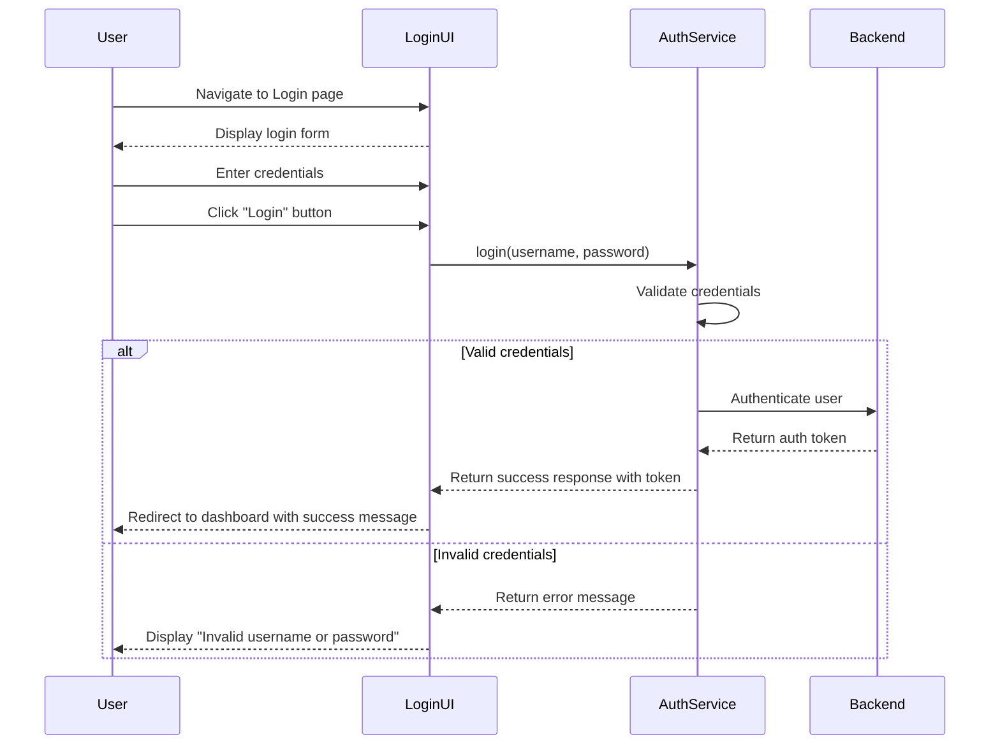

```mermaid
sequenceDiagram
    participant U as User
    participant L as LoginUI
    participant S as AuthService
    participant B as Backend

    U->>L: Navigate to Login page
    L-->>U: Display login form
    U->>L: Enter credentials
    U->>L: Click "Login" button
    L->>S: login(username, password)
    S->>S: Validate credentials
    alt Valid credentials
        S->>B: Authenticate user
        B-->>S: Return auth token
        S-->>L: Return success response with token
        L-->>U: Redirect to dashboard with success message
    else Invalid credentials
        S-->>L: Return error message
        L-->>U: Display "Invalid username or password"
    end

```
