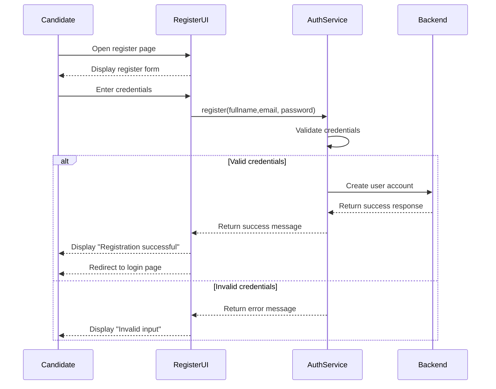

```mermaid
sequenceDiagram
    participant Candidate
    participant RegisterUI
    participant AuthService
    participant Backend

    Candidate->>RegisterUI: Open register page
    RegisterUI-->>Candidate: Display register form

    Candidate->>RegisterUI: Enter credentials
    RegisterUI->>AuthService: register(fullname,email, password)
    AuthService->>AuthService: Validate credentials
    alt Valid credentials
        AuthService->>Backend: Create user account
        Backend-->>AuthService: Return success response
        AuthService-->>RegisterUI: Return success message
        RegisterUI-->>Candidate: Display "Registration successful"
        RegisterUI-->>Candidate: Redirect to login page
    else Invalid credentials
        AuthService-->>RegisterUI: Return error message
        RegisterUI-->>Candidate: Display "Invalid input"
    end

```
