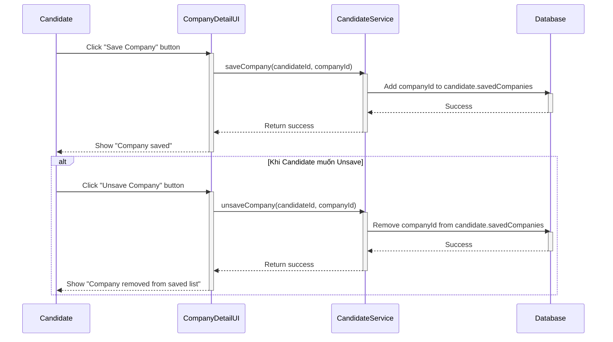

```mermaid
sequenceDiagram
    participant C as Candidate
    participant UI as CompanyDetailUI
    participant S as CandidateService
    participant DB as Database

    C->>UI: Click "Save Company" button
    activate UI
    UI->>S: saveCompany(candidateId, companyId)
    activate S
    S->>DB: Add companyId to candidate.savedCompanies
    activate DB
    DB-->>S: Success
    deactivate DB
    S-->>UI: Return success
    deactivate S
    UI-->>C: Show "Company saved"
    deactivate UI

    alt Khi Candidate muốn Unsave
        C->>UI: Click "Unsave Company" button
        activate UI
        UI->>S: unsaveCompany(candidateId, companyId)
        activate S
        S->>DB: Remove companyId from candidate.savedCompanies
        activate DB
        DB-->>S: Success
        deactivate DB
        S-->>UI: Return success
        deactivate S
        UI-->>C: Show "Company removed from saved list"
        deactivate UI
    end
```
