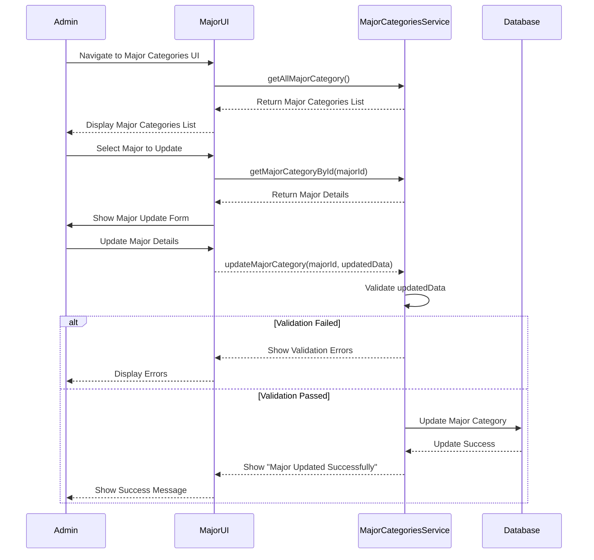

```mermaid
sequenceDiagram
    participant A as Admin
    participant U as MajorUI
    participant C as MajorCategoriesService
    participant B as Database

    A->>U: Navigate to Major Categories UI
    U->>C: getAllMajorCategory()
    C-->>U: Return Major Categories List
    U-->>A: Display Major Categories List
    A->>U: Select Major to Update
    U->>C: getMajorCategoryById(majorId)
    C-->>U: Return Major Details
    U->>A: Show Major Update Form
    A->>U: Update Major Details
    U-->>C: updateMajorCategory(majorId, updatedData)
    C->>C: Validate updatedData
    alt Validation Failed
        C-->>U: Show Validation Errors
        U-->>A: Display Errors
    else Validation Passed
        C->>B: Update Major Category
        B-->>C: Update Success
        C-->>U: Show "Major Updated Successfully"
        U-->>A: Show Success Message
    end
```
