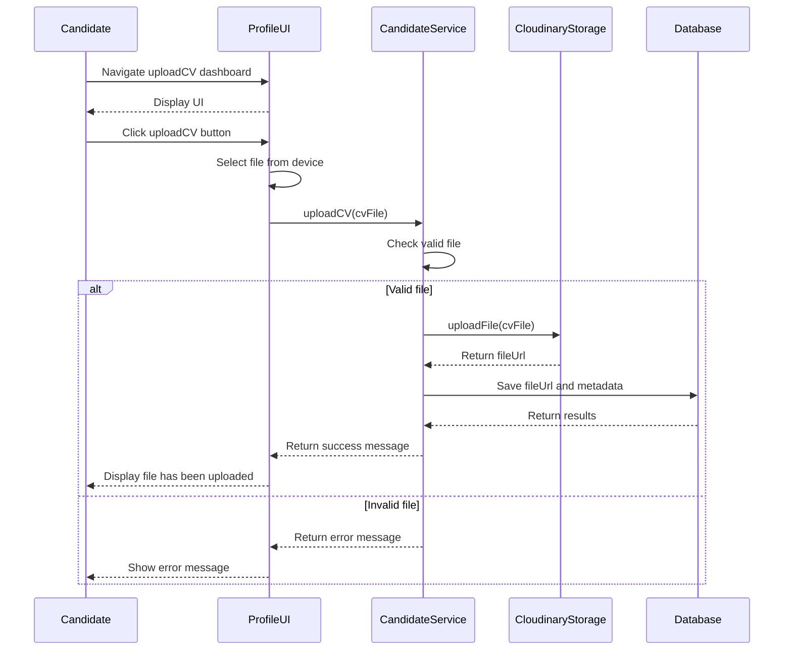

```mermaid
sequenceDiagram
    participant Candidate
    participant ProfileUI
    participant CandidateService
    participant CloudinaryStorage
    participant Database

    Candidate->>ProfileUI: Navigate uploadCV dashboard
    ProfileUI-->>Candidate: Display UI
    Candidate->>ProfileUI: Click uploadCV button
    ProfileUI->>ProfileUI: Select file from device
    ProfileUI->>CandidateService: uploadCV(cvFile)
    CandidateService->>CandidateService: Check valid file

    alt Valid file
        CandidateService->>CloudinaryStorage: uploadFile(cvFile)
        CloudinaryStorage-->>CandidateService: Return fileUrl
        CandidateService->>Database: Save fileUrl and metadata
        Database-->>CandidateService: Return results
        CandidateService-->>ProfileUI: Return success message
        ProfileUI-->>Candidate: Display file has been uploaded
    else Invalid file
        CandidateService-->>ProfileUI: Return error message
        ProfileUI-->>Candidate: Show error message
    end

```
